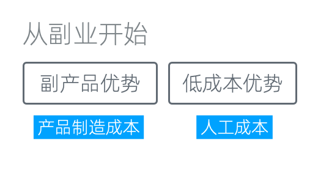
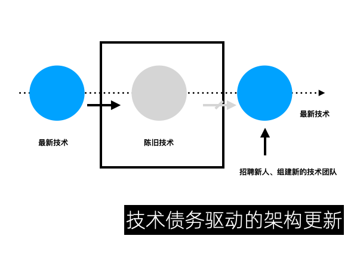

一人企业因为资源少、竞争大导致整体成功率不高。但如果我们能有效地控制其中的风险，那么会极大地提高成功率。本专题将讨论一人企业的风险控制相关事宜。

从优势开始
-----

首先，我要给大家的建议是，不要一时冲动就辞职。最佳的做法是从副业开始，从优势开始。这里涉及到两个核心优势：副产品优势和低成本优势。

### 副产品优势

谈到副产品优势，我们之前已经多次提到，副产品直接影响到我们的产品制造成本。

当我们有一份全职工作时，我们就能够产生副产品，而这部分副产品是零成本获得的。然而，像我这样，在离职后全职投入到一人业务中，就不再有所谓的主业副产品，这个优势就不再存在。

比如，如果我现在想要开发一个关于高并发开发的课程，我就需要自己投入成本，去积累相关方向的经验，甚至购买一些设备来进行相应的测试，以保证我课程中的项目能够承受相应的压力。而对于那些在大公司就职的人来说，这是他们天然具有的优势，他们无需任何成本就可以获得。因此，从副产品优势的角度来看，我建议大家先从副业开始。

### 低成本优势

其次，让我们谈谈低成本优势。在没有主业的情况下，我们的最低可行利润是一个绝对值。如果我们有一份主业，那么就有工资收入。这会极大地提升副业的韧性，即使较长时间不盈利，依然可以坚持下去。

我以前自己做的很多开源项目和服务都是免费的，每年可能会投入几千元的成本。这对于有主业收入的我来说，并不是什么大问题，因为每月收入的一小部分就足够覆盖这些成本了。然而，当我转向全职独立开发后，尤其是前期，挣钱变得非常困难，就很难承担这些看起来并不多的成本。这些成本迫使我将一些免费业务商业化，最终因祸得福地学会了如何商业化产品。

然而，以副业模式运营一人企业的一个挑战是，我们能投入副业的时间和精力是有限的。如果我们的主业经常需要加班，那么可用于副业的时间就会更少。这可能导致很多人的副业还未开始就结束了，因为他们没有足够的精力来投入。在这种情况下，我建议大家尽可能选择一个既能提供中等偏上的薪资，又能确保周末时间充足的公司。用主业保证最低收入，用副业拓展可能性，提升收入天花板。

双线收入，双重安全
---------

「从副业开始」还有一个好处，它会让我们具有双线收入，带来双重的财务和职业安全。这在经济下行的周期显得尤为重要。

很多程序员都在担心35岁以后公司不再需要他们怎么办，这个问题让他们焦虑，甚至早早地思考是要送外卖还是开网约车。但如果我们有副业、有了双线收入。即使被公司解雇了，副业虽然可能收入不多，但稍微控制一下生活成本，基本温饱还是不成问题的。这样，无论是从职业安全、财务安全，还是从个人心态上来讲，都会有很大的改善。

对于程序员和技术人群来讲，副业在职业安全上还有额外的意义。

技术债务驱动的架构更新

我之前在做[《从精益开发到精益副业》分享](https://www.bilibili.com/video/BV1xf4y1k7Be?t=1445.8)时提到过一个概念，叫做「技术债务驱动的架构更新」。

它描述的是，公司业务需求和程序员职业发展的矛盾。我们在公司里负责一个项目时，公司通常希望这个项目足够稳定，而不是追求使用最新的技术。直到原有技术不再适用，需要更新时，公司往往又不愿提供给原来的技术人员提供足够的学习时间来掌握新技术。相反，他们可能更愿意直接雇用掌握新技术的人员来替代。这种替代可能不是整个团队换掉那么明显，但确实很容易感受到的。这种架构更新的方式，犹如温水煮青蛙，很容易导致技术人员在不知不觉中被淘汰。

然而，如果我们拥有一个完全由自己决定技术栈的副业，那么在技术更新和职业安全上可以为我们提供进一步的保障。

渐进式成长
-----

一个好的模式是，从副业开始，不断增长MRR（月周期收入），逐步剥离对主业的依赖，直到副业和主业解耦以后，再考虑将副业转为主业。我们称这个模式为「渐进式成长」。

渐进式成长

采用渐进式成长的方式，可以低风险甚至无风险地运营一人企业。这种操作的难点在于，越是在早期，反而难度越大。

在副业初期，我们需要投入大量的休息时间，这可能让我们不能享受生活，没有时间去玩游戏看电影，但同时它可以避免我们陷入「生存压力」中。生存压力是我们的全部收入不足以支撑生活费用时的压力，这种心理上的压力非常大，甚至可以引起中年人的恐慌，只有亲历过的人才知道它的可怕。而且这种压力来自方方面面，包括家人和朋友，他们会好奇为什么你不找一个「正经工作」，甚至会帮你找一个。

随着我们副业开始逐渐成长，我们就能逐步建立起抗风险的能力。我们通常建议，当副业的收入与主业收入相当时，也就是两者基本持平时，再考虑完全转型的事情。这样在各方面都能实现平滑过度。当然，是否转型完全取决于你自己的决定。